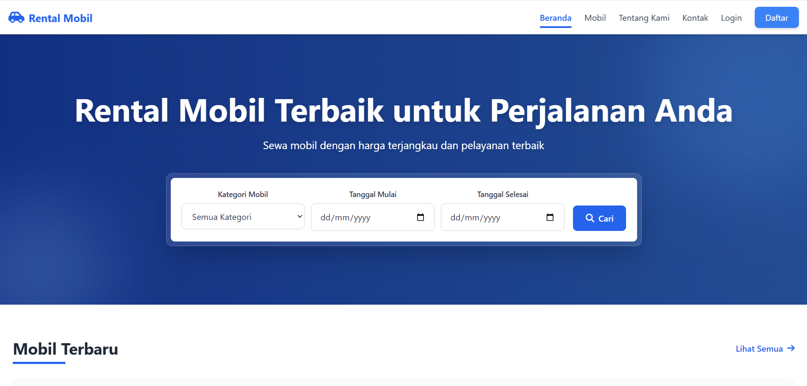
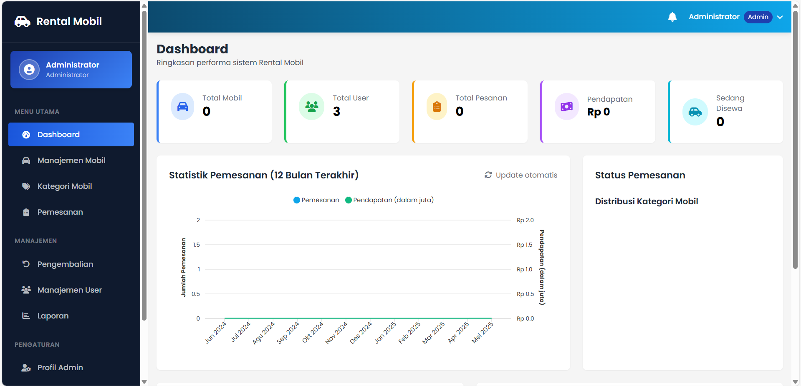
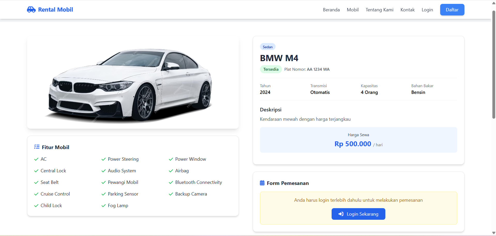

# 🚗 Sistem Rental Mobil


> 🌟 Sistem manajemen rental mobil modern dengan integrasi pembayaran Midtrans

<p align="center">
  
</p>

## Deskripsi Sistem

Sistem Rental Mobil adalah aplikasi berbasis web yang dikembangkan untuk manajemen bisnis penyewaan mobil. Sistem ini dibangun menggunakan PHP dengan database MySQL, dan menggunakan Tailwind CSS untuk tampilan yang modern dan responsif.

Aplikasi ini menyediakan dua akses utama:
1. **Panel Admin**: Untuk mengelola data mobil, kategori, pemesanan, pengembalian, dan laporan
2. **Situs Frontend**: Untuk pelanggan melakukan pencarian, pemesanan, dan pembayaran mobil

## Fitur Utama

### 1. Panel Admin
- **Manajemen Mobil**: Tambah, edit, hapus, dan lihat detail mobil
- **Manajemen Kategori**: Kelola kategori mobil (Sedan, SUV, MPV, dll)
- **Manajemen Pemesanan**: Lihat, konfirmasi, tolak, dan proses pembayaran pemesanan
- **Manajemen Pengembalian**: Proses pengembalian mobil dan hitung denda otomatis
- **Manajemen User**: Kelola data pelanggan dan admin
- **Profil Admin**: Edit informasi dan keamanan akun admin
- **Laporan**: Generate laporan pemesanan, pendapatan, mobil populer, dan user aktif
- **Export PDF**: Laporan dapat diunduh dalam format PDF

### 2. Frontend Pelanggan
- **Registrasi & Login**: Buat akun dan masuk ke sistem
- **Pencarian Mobil**: Filter berdasarkan kategori, tanggal, dan harga
- **Detail Mobil**: Informasi lengkap tentang mobil (spesifikasi, harga, fitur)
- **Pemesanan**: Proses pemesanan dengan konfirmasi
- **Pembayaran Online**: Integrasi dengan Midtrans Payment Gateway
- **Riwayat Pemesanan**: Lihat dan kelola riwayat pemesanan
- **Profil User**: Edit informasi pribadi dan kata sandi

## 🛠️ Teknologi yang Digunakan

<table>
  <tr>
    <td align="center"><br>PHP 7.4+</td>
    <td align="center"><br>MySQL</td>
    <td align="center"><br>Tailwind CSS</td>
    <td align="center"><br>Midtrans</td>
  </tr>
</table>

## Cara Instalasi

<details>
<summary>📋 Prasyarat</summary>

- PHP 7.4 atau lebih tinggi
- MySQL/MariaDB
- Composer
- Web Server (Apache/Nginx)
- Akun Midtrans (untuk fitur payment gateway)

</details>

<details>
<summary>⚙️ Langkah Instalasi</summary>

1. **Clone repositori**
   ```
   git clone https://github.com/arydianprtma/ren-car.git
   cd rental-mobil
   ```

2. **Instal dependensi PHP**
   ```
   composer install
   ```

3. **Konfigurasi database**
   - Buat database MySQL baru
   - Impor file SQL dari `database/rental_mobil.sql`
   - Sesuaikan konfigurasi database di `config/database.php`

4. **Konfigurasi Midtrans Payment Gateway**
   - Daftar akun di [Midtrans](https://midtrans.com/)
   - Dapatkan API keys (Client Key dan Server Key)
   - Sesuaikan konfigurasi di `config/midtrans/config.php`

5. **Konfigurasi aplikasi**
   - Sesuaikan pengaturan di `config/config.php`
   - Atur BASE_URL dan path lainnya

6. **Akses aplikasi**
   - Buka browser dan akses URL sesuai konfigurasi
   - Login admin default:
     - Username: admin
     - Password: admin123

</details>

## 🔄 Implementasi Sistem Terdistribusi


Sistem Rental Mobil mengimplementasikan konsep sistem terdistribusi melalui **integrasi Payment Gateway Midtrans**. Berikut adalah detail implementasinya:

### 1. Arsitektur Microservices

Sistem ini mengadopsi pendekatan microservices dalam pemrosesan pembayaran:

- **Sistem Rental Mobil (Local Server)**: Menangani manajemen mobil, user, dan pemesanan
- **Midtrans Payment Gateway (External Server)**: Menangani pemrosesan pembayaran dan keamanan transaksi
- **Komunikasi via API**: Kedua sistem berkomunikasi melalui API endpoints yang terdefinisi dengan jelas

### 2. Alur Transaksi Terdistribusi

1. **Inisiasi Transaksi**:
   - User melakukan pemesanan di sistem rental
   - Sistem rental mengirim request ke server Midtrans untuk membuat transaksi
   - Server Midtrans mengembalikan token transaksi

2. **Pemrosesan Pembayaran**:
   - User diarahkan ke halaman pembayaran Midtrans
   - User memilih metode pembayaran (bank transfer, e-wallet, dll)
   - Midtrans memproses pembayaran dan mengirim notifikasi ke callback URL

3. **Sinkronisasi Status**:
   - Midtrans mengirim notifikasi status pembayaran (webhook)
   - Sistem rental memperbarui status pemesanan sesuai notifikasi

### 3. Implementasi Teknis

#### a. File Konfigurasi Midtrans
```php
// Konstanta Mode Midtrans
define('MIDTRANS_IS_SANDBOX', true);

// API Credentials
define('MIDTRANS_SERVER_KEY', 'SB-Mid-server-xxxxx');
define('MIDTRANS_CLIENT_KEY', 'SB-Mid-client-xxxxx');

// Endpoints
define('MIDTRANS_SNAP_URL', 'https://app.sandbox.midtrans.com/snap/snap.js');
define('MIDTRANS_SNAP_API_URL', 'https://app.sandbox.midtrans.com/snap/v1/transactions');

// Callback URLs
define('MIDTRANS_NOTIFICATION_URL', 'payments/midtrans/notification.php');
define('MIDTRANS_FINISH_URL', 'payments/midtrans/finish.php');
```

#### b. Notification Handler (Webhook)
```php
// File notification.php - Menerima notifikasi dari Midtrans
$notificationJson = file_get_contents('php://input');
$notification = json_decode($notificationJson, true);

// Validasi signature untuk keamanan
$mySignature = hash('sha512', $orderId . $statusCode . $grossAmount . MIDTRANS_SERVER_KEY);
if ($signature !== $mySignature) {
    http_response_code(403);
    exit;
}

// Update status pemesanan berdasarkan status Midtrans
switch ($transactionStatus) {
    case 'settlement':
        $statusPemesanan = 'dikonfirmasi';
        break;
    case 'pending':
        $statusPemesanan = 'menunggu';
        break;
    case 'cancel':
        $statusPemesanan = 'dibatalkan';
        break;
}

// Update database
$stmt = $conn->prepare("UPDATE pemesanan SET status_pemesanan = ? WHERE kode_pemesanan = ?");
$stmt->execute([$statusPemesanan, $kode_pemesanan]);
```

### 4. Implementasi Konsep Sistem Terdistribusi

#### a. Distributed Transactions
- Transaksi dibagi antara sistem rental dan Midtrans
- Two-phase commit: pemesanan di-commit setelah konfirmasi Midtrans

#### b. Asynchronous Communication
- Webhook untuk notifikasi asinkron
- Callback URLs untuk redirect user setelah pembayaran

#### c. Fault Tolerance
- Sistem retry untuk pembayaran gagal
- Logging transaksi di kedua sistem
- Penanganan exception untuk error handling

#### d. State Management
- Status transaksi disimpan dan disinkronkan antar sistem
- Mekanisme validasi signature untuk keamanan

#### e. Distributed Data
- Data pembayaran disimpan di sistem Midtrans
- Data pemesanan disimpan di sistem rental
- Sinkronisasi melalui ID transaksi unik

### 5. Metode Pembayaran yang Tersedia

Integrasi dengan Midtrans memungkinkan berbagai metode pembayaran:

- Kartu Kredit/Debit
- Virtual Account (BCA, BNI, BRI, Mandiri)
- E-wallet (GoPay, ShopeePay, OVO)
- QRIS
- Convenience Store (Alfamart, Indomaret)

## Modul Fitur Laporan

### Deskripsi
Modul laporan menyediakan informasi statistik dan analitik tentang operasional rental mobil. Admin dapat melihat berbagai data seperti tren pemesanan, pendapatan, mobil populer, dan user aktif.

### Cara Penggunaan Modul Laporan

1. **Mengakses Halaman Laporan**:
   - Login sebagai admin
   - Klik menu "Laporan" di sidebar

2. **Memilih Jenis Laporan**:
   - Laporan Pemesanan: Menampilkan jumlah pemesanan per hari
   - Laporan Pendapatan: Menampilkan total pendapatan per hari
   - Laporan Mobil Populer: Menampilkan mobil dengan jumlah sewa terbanyak
   - Laporan User Aktif: Menampilkan user dengan jumlah sewa terbanyak

3. **Memfilter Data**:
   - Pilih tanggal awal dan akhir untuk periode laporan
   - Klik tombol "Filter" untuk menampilkan data

4. **Mengexport ke PDF**:
   - Klik tombol "Export PDF" untuk mengunduh laporan dalam format PDF
   - PDF berisi data statistik dan tabel detail sesuai jenis laporan

### Implementasi Teknis

1. **File Utama**:
   - `admin/laporan/index.php`: Halaman utama laporan dengan filter dan grafik
   - `admin/laporan/export_pdf.php`: Skrip untuk menghasilkan file PDF

2. **Dependensi**:
   - Chart.js: Untuk visualisasi data dalam bentuk grafik
   - mPDF: Untuk generate laporan PDF

3. **Query Database**:
   - Query agregasi untuk menghitung statistik (COUNT, SUM, GROUP BY)
   - JOIN antar tabel untuk mendapatkan data relasional

## Analisis Sistem

### Kelebihan
1. **Sistem Pembayaran Terdistribusi**: Integrasi dengan payment gateway meningkatkan keamanan dan kemudahan pembayaran
2. **Antarmuka yang Intuitif**: Desain UI/UX yang mudah digunakan
3. **Fitur Komprehensif**: Mencakup seluruh siklus bisnis rental mobil
4. **Responsif**: Dapat diakses dari berbagai perangkat
5. **Visualisasi Data**: Grafik dan statistik memudahkan analisis bisnis

### Keterbatasan
1. **Ketergantungan pada Pihak Ketiga**: Memerlukan koneksi ke server Midtrans untuk transaksi
2. **Kompleksitas Integrasi**: Memerlukan pengelolaan error dan status transaksi yang cermat
3. **Ketergantungan Jaringan**: Memerlukan koneksi internet yang stabil

## Panduan untuk Dokumen Laporan Akhir Sistem Terdistribusi

Dalam menyusun laporan akhir untuk tugas sistem terdistribusi, sebaiknya menyertakan:

1. **Pendahuluan**:
   - Latar belakang integrasi payment gateway dalam rental mobil
   - Tujuan dan manfaat sistem terdistribusi
   - Ruang lingkup implementasi

2. **Kajian Teori**:
   - Konsep dasar sistem terdistribusi
   - Arsitektur microservices
   - Payment gateway dan transaksi terdistribusi

3. **Perancangan Sistem**:
   - Arsitektur sistem terdistribusi Rental Mobil-Midtrans
   - Diagram alur transaksi pembayaran
   - Skema komunikasi antar sistem

4. **Implementasi**:
   - Konfigurasi integrasi Midtrans
   - Implementasi webhook dan callback
   - Penanganan sinkronisasi status

5. **Pengujian**:
   - Skenario transaksi berhasil, pending, dan gagal
   - Pengujian fault tolerance
   - Evaluasi performa dan keamanan

6. **Penutup**:
   - Kesimpulan implementasi sistem terdistribusi
   - Saran pengembangan lebih lanjut

## Kesimpulan

Sistem Rental Mobil berhasil mengimplementasikan konsep sistem terdistribusi melalui integrasi payment gateway Midtrans. Integrasi ini mendemonstrasikan beberapa prinsip penting sistem terdistribusi seperti arsitektur microservices, komunikasi asinkron, toleransi kesalahan, dan distributed transaction. Sistem ini tidak hanya memberikan pengalaman pembayaran yang lebih baik untuk pengguna, tetapi juga meningkatkan keamanan dan reliabilitas transaksi dengan mendistribusikan tanggung jawab pemrosesan pembayaran ke penyedia layanan terpercaya.

## 📊 Screenshot

<p align="center">
  
  
</p>

## 👥 Tim Pengembang

<table>
  <tr>
    <td align="center">
      <a href="https://github.com/arydianprtma">
        <sub><b>Nama Developer 1</b></sub>
      </a>
    </td>
    <td align="center">
      <a href="https://github.com/username2">
        <sub><b>Nama Developer 2</b></sub>
      </a>
    </td>
  </tr>
</table>

## 📝 Lisensi

Proyek ini dilisensikan di bawah Lisensi MIT - lihat file [LICENSE](LICENSE) untuk detailnya.

---

<p align="center">
  Dibuat dengan ❤️ oleh Tim Pengembang<br>
  © 2025 Rental Mobil. All rights reserved.
</p>